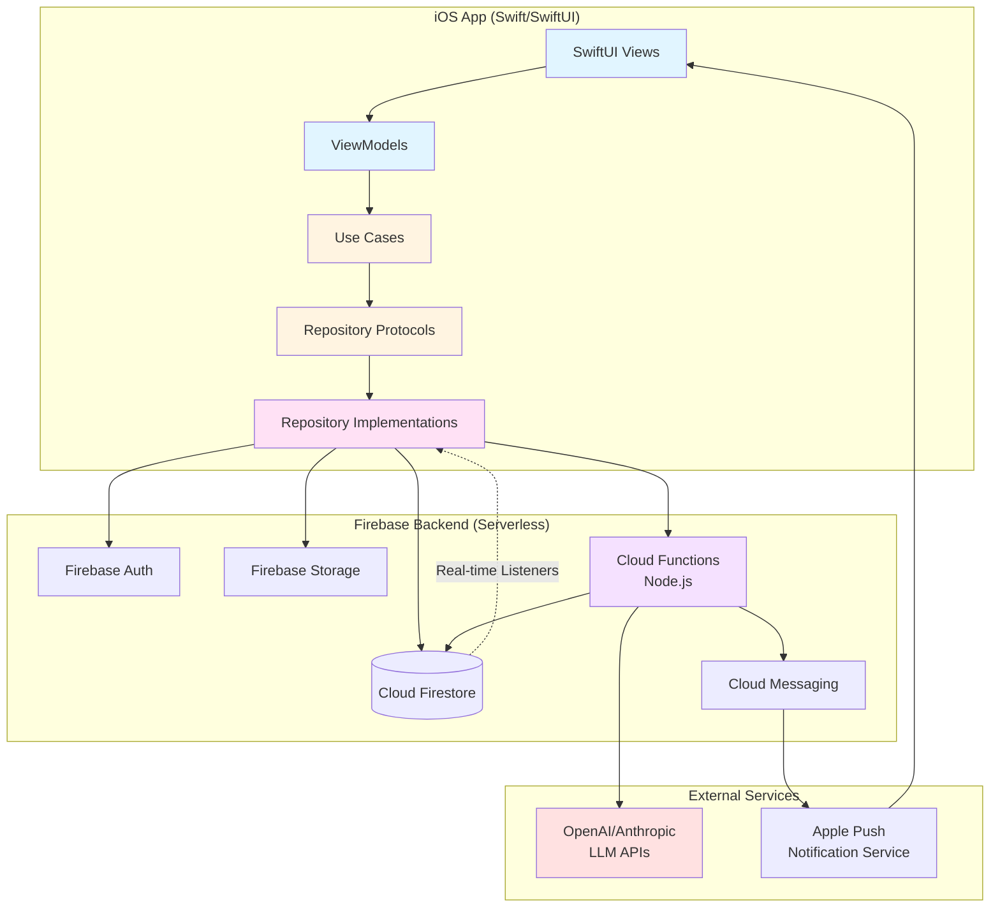

# MessageAI Architecture Document

## Introduction

This document outlines the complete architecture for MessageAI, an AI-powered messaging application for remote team professionals. The system combines a native iOS mobile frontend with Firebase serverless backend services, creating a robust fullstack solution optimized for real-time communication and intelligent insights.

This architecture serves as the single source of truth for AI-driven development, ensuring consistency across iOS client development, Firebase backend services, and AI feature integration. The design prioritizes Clean Architecture principles (MVVM), test-first development, and production-quality reliability.

### Architectural Philosophy

The MessageAI architecture is optimized for **rapid development with high quality** in a 7-day sprint with a solo developer learning Swift. Three core principles guide all decisions:

1. **Test Velocity Over Simplicity**: Clean Architecture adds structural complexity but enables fast unit testing with mocked dependencies, providing rapid feedback essential for learning Swift while maintaining 70%+ code coverage.

2. **Time-to-Market Over Flexibility**: Firebase serverless backend eliminates infrastructure management (authentication, real-time sync, push notifications, file storage) allowing focus on product differentiation through AI features. Vendor lock-in is an acceptable trade-off for 7-day delivery.

3. **Platform Excellence Over Reach**: iOS-only focus enables production-quality experience with MessageKit integration and native UX, rather than compromised quality across multiple platforms.

These principles reflect pragmatic decisions validated through Five Whys analysis: the repository pattern enables both testability and Firebase abstraction; real-time requirements demand Firebase's WebSocket infrastructure over REST polling; and MessageKit provides professional chat UI that would otherwise consume 20-30% of development time.

### Starter Template or Existing Project

**N/A - Greenfield Project**

This is a new iOS application built from scratch. No starter templates are being used. The project follows Apple's standard iOS app structure with Xcode, enhanced with Clean Architecture patterns and Firebase SDK integration via Swift Package Manager.

### Change Log

| Date | Version | Description | Author |
|------|---------|-------------|---------|
| 2025-10-20 | 1.0 | Initial architecture document created | Winston (Architect) |

---

## High Level Architecture

### Technical Summary

MessageAI implements a **mobile-first Clean Architecture** with iOS native frontend and Firebase serverless backend. The iOS app uses SwiftUI with MVVM pattern, where ViewModels orchestrate use cases that interact with Firebase through repository protocol abstractions. Real-time messaging leverages Firestore snapshot listeners for < 2 second delivery, while offline-first persistence ensures zero message loss. AI features (summarization, action extraction, smart search, priority detection, decision tracking) execute server-side via Node.js Cloud Functions calling OpenAI/Anthropic APIs, protecting credentials and enabling aggressive result caching. The architecture achieves PRD goals through: (1) Clean Architecture enabling 70%+ test coverage for reliability, (2) Firebase eliminating backend infrastructure complexity, (3) MessageKit providing professional chat UI out-of-the-box, (4) Serverless AI integration optimizing costs through caching, and (5) offline-first data strategy guaranteeing message persistence across network conditions.

### Platform and Infrastructure Choice

**Platform:** Firebase (Google Cloud Platform)

**Key Services:**
- **Firebase Authentication**: Email/password authentication with automatic token refresh
- **Cloud Firestore**: Real-time NoSQL database with offline persistence for messages, conversations, users
- **Firebase Cloud Functions**: Node.js serverless functions for AI service calls and push notification generation
- **Firebase Cloud Messaging (FCM)**: Push notifications with APNs integration for iOS
- **Firebase Storage**: Image attachment hosting with security rules
- **Firebase Hosting**: (Future) Web admin dashboard if needed

**Deployment Host and Regions:**
- **Development Environment**: `us-central1` (Firebase default, lowest latency for development)
- **Production Environment**: `us-central1` (primary) with potential multi-region expansion post-MVP
- **iOS App Deployment**: TestFlight for beta testing, App Store for production

**Platform Rationale:**

Firebase was selected over alternatives (AWS Amplify, Supabase, custom backend) for three key reasons:

1. **Integrated Real-Time Infrastructure**: Firestore provides WebSocket-based real-time listeners out-of-the-box, essential for < 2 second message delivery without building custom WebSocket servers
2. **Offline-First by Design**: Firestore offline persistence automatically caches data and queues writes, solving the complex offline message queue requirement with minimal code
3. **Complete Backend-as-a-Service**: Authentication, file storage, push notifications, and serverless compute in one ecosystem eliminates integration complexity

**Alternative Considered:**
- **AWS Amplify**: More flexible but requires more manual configuration (Cognito + AppSync + Lambda + S3). Higher complexity for solo developer.
- **Supabase**: PostgreSQL-based with real-time subscriptions. Less mature iOS SDK, and relational schema adds complexity for flexible message data.
- **Custom Node.js Backend**: Maximum control but requires building auth, WebSocket infrastructure, push notification service, and deployment pipeline—unacceptable time investment for 7-day sprint.

### Repository Structure

**Structure:** Monorepo (Single Xcode Project)

**Monorepo Tool:** N/A (Standard Xcode project structure sufficient for iOS-only app)

**Package Organization:**

```
MessageAI/ (Git root)
├── MessageAI.xcodeproj          # Xcode project file
├── MessageAI/                    # iOS app source code
│   ├── App/                      # Application entry and DI
│   ├── Domain/                   # Business logic layer
│   │   ├── Entities/            # Pure Swift models
│   │   ├── UseCases/            # Business logic operations
│   │   └── Repositories/        # Repository protocols
│   ├── Data/                     # Data layer
│   │   ├── Repositories/        # Firebase implementations
│   │   ├── Network/             # Service wrappers
│   │   └── Models/              # Firebase DTOs
│   ├── Presentation/             # UI layer
│   │   ├── ViewModels/          # MVVM view models
│   │   ├── Views/               # SwiftUI views
│   │   └── Components/          # Reusable UI components
│   └── Resources/               # Assets, fonts, config files
├── MessageAITests/              # Unit and integration tests
├── MessageAIUITests/            # UI automation tests
├── CloudFunctions/              # Firebase Cloud Functions (Node.js)
│   ├── functions/
│   │   ├── src/
│   │   │   ├── ai/              # AI service integrations
│   │   │   ├── messaging/       # Message-related functions
│   │   │   └── notifications/   # Push notification logic
│   │   ├── package.json
│   │   └── index.js
│   └── .firebaserc              # Firebase project config
├── docs/                        # Project documentation
│   ├── prd.md
│   ├── architecture.md
│   └── stories/
└── .bmad-core/                  # BMAD workflow files
```

**Rationale:**
- iOS apps naturally fit monorepo structure—no need for polyrepo complexity
- Cloud Functions separated into `CloudFunctions/` directory but same Git repo for atomic versioning
- Clean Architecture folders enforce separation of concerns without complex tooling
- Tests colocated with source for easy discovery and maintenance

### High Level Architecture Diagram



### Architectural Patterns

**Overall Architecture:**

- **Clean Architecture (MVVM):** Separation of concerns with dependency inversion. Domain layer (entities, use cases) has zero external dependencies. Presentation and Data layers depend on Domain abstractions. Enables comprehensive unit testing with mocked repositories.  
  _Rationale:_ Achieves 70%+ code coverage requirement by making business logic testable without UI or Firebase dependencies. Critical for solo developer learning Swift—fast unit test feedback catches mistakes early.

- **Offline-First Architecture:** All data operations assume network unavailability. Firestore offline persistence automatically caches reads and queues writes. App remains fully functional offline with graceful degradation for AI features.  
  _Rationale:_ Satisfies PRD's zero message loss requirement and offline message queue functionality. Firestore handles complex synchronization logic automatically.

- **Serverless Backend:** No long-running servers. Cloud Functions execute on-demand for AI operations and push notifications. Firestore handles all data persistence and real-time sync.  
  _Rationale:_ Eliminates server management, auto-scales with usage, and optimizes costs (pay-per-execution). Perfect for MVP with unpredictable load patterns.

**Frontend Patterns (iOS):**

- **MVVM (Model-View-ViewModel):** SwiftUI Views bind to ViewModels via `@Published` properties. ViewModels coordinate use cases and expose UI state. Views are dumb presentation only.  
  _Rationale:_ Natural fit for SwiftUI's declarative paradigm. ViewModels are pure Swift classes easily tested without UI dependencies.

- **Repository Pattern:** Abstract data sources behind protocol interfaces. ViewModels depend on protocols, not concrete Firebase implementations. Enables swapping real repositories with mocks for testing.  
  _Rationale:_ Decouples business logic from Firebase specifics. Makes 70%+ test coverage achievable through fast unit tests with mocked data.

- **Use Case Pattern:** Single-responsibility classes encapsulating business operations (SendMessageUseCase, SummarizeThreadUseCase). Each use case has one public method and clear inputs/outputs.  
  _Rationale:_ Enforces separation of concerns and makes testing granular. Each use case tests independently without complex setup.

**Backend Patterns (Firebase Cloud Functions):**

- **Function-per-Feature:** Each AI capability is a separate Cloud Function (`summarizeThread`, `extractActionItems`, `detectPriorityMessages`). Functions are stateless and idempotent.  
  _Rationale:_ Enables independent deployment and scaling. Failures isolated to specific features without cascading.

- **Cache-Aside Pattern:** Cloud Functions check Firestore cache before calling expensive LLM APIs. Cache keys include message hashes for invalidation.  
  _Rationale:_ Reduces AI costs by 70%+ (estimated) through aggressive caching of summaries, action items, and search results.

**Integration Patterns:**

- **Backend-for-Frontend (BFF):** Cloud Functions act as iOS-specific API layer, formatting LLM responses into client-friendly JSON structures.  
  _Rationale:_ Protects API keys from client exposure and centralizes AI prompt engineering logic.

- **Real-Time Sync:** Firestore snapshot listeners provide push-based data updates. iOS app observes changes via AsyncStream or Combine publishers.  
  _Rationale:_ Achieves < 2 second message delivery requirement without polling overhead or WebSocket management.

- **Optimistic UI Updates:** Messages appear in UI immediately before server confirmation. Background sync updates status (sending → sent → delivered → read).  
  _Rationale:_ Provides instant user feedback while background reliability ensures delivery. Critical for responsive messaging UX.

---

## Tech Stack

This is the DEFINITIVE technology selection for the entire project. All development must use these exact technologies and versions.

### Technology Stack Table

| Category | Technology | Version | Purpose | Rationale |
|----------|-----------|---------|---------|-----------|
| **iOS Language** | Swift | 5.9+ | Primary development language | Modern, type-safe, native iOS language. Protocol-oriented design fits Clean Architecture. Strong concurrency support (async/await). |
| **iOS Framework** | SwiftUI | iOS 15+ | Declarative UI framework | Native Apple framework with live preview, automatic dark mode, built-in accessibility. Natural MVVM fit with `@Published` bindings. |
| **Chat UI Library** | MessageKit | 4.2.0 | Professional chat UI components | Provides production-quality message bubbles, input bar, typing indicators, image messages. Saves 20-30% development time vs custom UI. |
| **Image Loading** | Kingfisher | 7.10.0 | Async image loading and caching | Battle-tested library for profile pictures and message attachments. Memory-efficient caching and placeholder support. |
| **State Management** | Combine + @Published | Native (iOS 15+) | Reactive state management | Native Apple framework. ViewModels use `@Published` for SwiftUI bindings. Observable pattern for real-time updates. |
| **Backend Platform** | Firebase | Latest (10.x) | Complete BaaS solution | Serverless backend with auth, real-time database, cloud functions, push notifications, and file storage in one ecosystem. |
| **Database** | Cloud Firestore | Firestore SDK | NoSQL real-time database | Real-time listeners with < 500ms latency for message delivery. Built-in offline persistence with query-level caching. Flexible document model for complex queries. |
| **Authentication** | Firebase Auth | Firebase SDK | User authentication | Email/password authentication with automatic token refresh. Seamless integration with Firestore security rules. |
| **Cloud Functions** | Firebase Cloud Functions | Node.js 18 | Serverless compute for AI | Protects API keys from client. Executes AI calls server-side. Automatic scaling and pay-per-execution pricing. |
| **Push Notifications** | Firebase Cloud Messaging | Firebase SDK + APNs | Push notification delivery | FCM handles device token management. Integrates with APNs for iOS delivery. Cloud Functions trigger notifications. |
| **File Storage** | Firebase Storage | Firebase SDK | Image attachment storage | Secure file uploads with size limits. Security rules restrict access. CDN-backed for fast delivery. |
| **AI Provider** | OpenAI GPT-4 | gpt-4-turbo | LLM for AI features | Function calling support for structured outputs. Strong performance on summarization and extraction tasks. (Alternative: Anthropic Claude 3) |
| **iOS Testing** | XCTest | Native (Xcode) | Unit and integration testing | Native Apple testing framework. Fast unit tests with mocked repositories. UI testing for critical flows. |
| **Cloud Functions Testing** | Jest | 29.x | Node.js unit testing | Industry standard for Node.js testing. Mock Firebase and AI APIs for isolated tests. |
| **E2E Testing** | XCTest UI Testing | Native (Xcode) | End-to-end user flows | Native iOS UI automation. Test critical flows: login, message send, AI features. |
| **Dependency Manager** | Swift Package Manager | Native (Xcode) | iOS dependency management | Native Apple tool. No additional build tools needed. Manages Firebase SDK, MessageKit, Kingfisher. |
| **Version Control** | Git | 2.x | Source control | Industry standard. Atomic commits for Cloud Functions + iOS app changes. |
| **CI/CD** | Manual + Xcode Cloud (Future) | N/A | Build and deployment | MVP: Manual TestFlight uploads. Future: Xcode Cloud for automated builds and tests. |
| **Monitoring** | Firebase Crashlytics | Firebase SDK | Crash reporting | Real-time crash reports with stack traces. User-impact metrics. Free tier sufficient for MVP. |
| **Analytics** | Firebase Analytics | Firebase SDK | Usage tracking | Track AI feature usage, message volume, user engagement. Helps optimize costs and features. |
| **Logging** | OSLog | Native (iOS) | iOS app logging | Native Apple logging framework. Unified logging system with log levels. Production logs excluded via build flags. |
| **API Security** | iOS Keychain | Native (iOS) | Secure credential storage | Store Firebase config and API keys securely. Never hardcode credentials in source. |

**Key Technology Decisions:**

1. **Swift 5.9+ over Objective-C**: Modern language with async/await concurrency, protocol-oriented design, and strong type safety. Essential for Clean Architecture implementation.

2. **SwiftUI over UIKit**: Declarative paradigm matches MVVM pattern naturally. Live previews accelerate UI development. Automatic dark mode and accessibility support.

3. **MessageKit**: Massive time-saver for chat UI. Production-quality components eliminate need to build message bubbles, input bars, typing indicators from scratch.

4. **Combine over third-party reactive frameworks (RxSwift)**: Native Apple framework with zero external dependencies. Sufficient for this app's reactive needs.

5. **Firestore over Realtime Database**: Real-time listeners provide < 500ms message delivery (well within < 2s requirement). Superior querying, structured collections, and query-level offline caching. Realtime Database's slightly lower latency (50-200ms vs 100-500ms) is imperceptible to users and doesn't justify sacrificing powerful queries and offline capabilities.

6. **OpenAI GPT-4 over Claude (Primary choice)**: Function calling provides structured outputs for action items and decisions. Alternative is Claude 3 if API access issues.

7. **Native testing over third-party frameworks**: XCTest provides everything needed. Quick/Nimble would add dependencies without significant value.

8. **Swift Package Manager over CocoaPods/Carthage**: Native tool integrated into Xcode. Modern, declarative dependency management.

9. **Manual CI/CD for MVP**: Automated pipelines would consume setup time. Manual TestFlight uploads acceptable for 7-day sprint. Xcode Cloud migration post-MVP.

10. **Firebase Crashlytics over Sentry**: Already using Firebase ecosystem. One less external service to integrate. Free tier covers MVP needs.

---

## Data Models

Core domain entities representing the business objects shared between iOS app and Firebase backend. These models are defined as pure Swift structs conforming to `Codable`, `Equatable`, and `Identifiable` protocols. All models include schema versioning for future migration support.

### User

**Purpose:** Represents an authenticated user of the MessageAI application. Stores profile information, online presence, and metadata for display in conversations.

**Key Attributes:**
- `id: String` - Unique identifier (matches Firebase Auth UID)
- `email: String` - User's email address (from Firebase Auth)
- `displayName: String` - User's chosen display name (default: email prefix)
- `profileImageURL: String?` - Optional URL to profile picture in Firebase Storage
- `isOnline: Bool` - Current online/offline status
- `lastSeen: Date` - Timestamp of last app activity
- `createdAt: Date` - Account creation timestamp
- `fcmToken: String?` - Firebase Cloud Messaging device token for push notifications
- `timezone: String?` - IANA timezone identifier (e.g., "America/New_York") for scheduling features
- `locale: String?` - Locale identifier (e.g., "en-US") for formatting
- `preferredLanguage: String?` - ISO 639-1 language code for AI summaries
- `schemaVersion: Int` - Model version for data migration (current: 1)

**Swift Interface:**

```swift
struct User: Codable, Equatable, Identifiable {
    let id: String
    let email: String
    var displayName: String
    var profileImageURL: String?
    var isOnline: Bool
    var lastSeen: Date
    let createdAt: Date
    var fcmToken: String?
    var timezone: String?
    var locale: String?
    var preferredLanguage: String?
    let schemaVersion: Int = 1
    
    // Computed property for display
    var displayInitials: String {
        displayName.prefix(2).uppercased()
    }
}
```

**Relationships:**
- One User → Many Conversations (as participant)
- One User → Many Messages (as sender)
- One User → Many ActionItems (as assignee)

---

### Message

**Purpose:** Represents a single message in a conversation. Supports text, image attachments, and tracks delivery/read status. Includes edit history (capped at 10) and AI-generated metadata.

**Key Attributes:**
- `id: String` - Unique message identifier (UUID)
- `conversationId: String` - Parent conversation reference
- `senderId: String` - User ID of sender
- `text: String` - Message content (empty for image-only messages)
- `timestamp: Date` - Message creation time (Firebase server timestamp)
- `status: MessageStatus` - Enum: sending, sent, delivered, read, failed
- `statusUpdatedAt: Date` - Timestamp of last status change (prevents race conditions)
- `attachments: [MessageAttachment]` - Array of images or files
- `editHistory: [MessageEdit]?` - Optional array of previous versions (MAX 10)
- `editCount: Int` - Total number of edits (continues incrementing after 10)
- `isEdited: Bool` - Flag indicating message has been edited
- `isDeleted: Bool` - Flag for unsent messages (shows placeholder)
- `deletedAt: Date?` - When message was deleted
- `deletedBy: String?` - User ID who deleted message
- `readBy: [String]` - Array of user IDs who have read (for 1-on-1 and small groups)
- `readCount: Int` - Count of readers (for large groups, instead of full array)
- `isPriority: Bool` - AI-detected priority flag
- `priorityReason: String?` - AI explanation for priority status
- `schemaVersion: Int` - Model version for data migration (current: 1)

**Swift Interface:**

```swift
enum MessageStatus: String, Codable {
    case sending
    case sent
    case delivered
    case read
    case failed
    
    var sortOrder: Int {
        switch self {
        case .sending: return 0
        case .failed: return 0
        case .sent: return 1
        case .delivered: return 2
        case .read: return 3
        }
    }
    
    func canTransitionTo(_ newStatus: MessageStatus) -> Bool {
        return newStatus.sortOrder >= self.sortOrder
    }
}

struct MessageAttachment: Codable, Equatable {
    let id: String
    let type: AttachmentType
    let url: String
    let thumbnailURL: String?
    let sizeBytes: Int64
    
    enum AttachmentType: String, Codable {
        case image
        case video  // Future
        case file   // Future
    }
}

struct MessageEdit: Codable, Equatable {
    let text: String
    let editedAt: Date
}

struct Message: Codable, Equatable, Identifiable {
    let id: String
    let conversationId: String
    let senderId: String
    var text: String
    let timestamp: Date
    var status: MessageStatus
    var statusUpdatedAt: Date
    var attachments: [MessageAttachment]
    var editHistory: [MessageEdit]?
    var editCount: Int
    var isEdited: Bool
    var isDeleted: Bool
    var deletedAt: Date?
    var deletedBy: String?
    var readBy: [String]
    var readCount: Int
    var isPriority: Bool
    var priorityReason: String?
    let schemaVersion: Int = 1
    
    static let maxEditHistory = 10
}
```

**Relationships:**
- Many Messages → One Conversation
- One Message → One User (sender)
- One Message → One Decision (optional, if marked as decision)

---

### Conversation

**Purpose:** Represents a chat conversation between 2+ users. Tracks participants, unread counts, typing status, and last message metadata for conversation list display. Includes AI metadata for Insights dashboard queries.

**Key Attributes:**
- `id: String` - Unique conversation identifier (UUID)
- `participantIds: [String]` - Array of user IDs in conversation (MAX 10)
- `lastMessage: String?` - Preview text of most recent message
- `lastMessageTimestamp: Date?` - Timestamp of last message
- `lastMessageSenderId: String?` - Who sent the last message
- `lastMessageId: String?` - ID of last message (for AI cache validation)
- `unreadCounts: [String: Int]` - Dictionary of userId → unread count
- `typingUsers: [String]` - Array of user IDs currently typing
- `createdAt: Date` - Conversation creation timestamp
- `isGroup: Bool` - True if 3+ participants
- `groupName: String?` - Optional custom group name
- `lastAISummaryAt: Date?` - When conversation was last summarized
- `hasUnreadPriority: Bool` - True if unread priority messages exist
- `priorityCount: Int` - Count of priority messages requiring attention
- `activeSchedulingDetected: Bool` - AI detected scheduling discussion
- `schedulingDetectedAt: Date?` - When scheduling was detected
- `isMuted: Bool` - User muted notifications for this conversation
- `mutedUntil: Date?` - Optional time-based mute expiration
- `isArchived: Bool` - Soft delete (recoverable for 30 days)
- `archivedAt: Date?` - When conversation was archived
- `schemaVersion: Int` - Model version for data migration (current: 1)

**Swift Interface:**

```swift
struct Conversation: Codable, Equatable, Identifiable {
    let id: String
    var participantIds: [String]
    var lastMessage: String?
    var lastMessageTimestamp: Date?
    var lastMessageSenderId: String?
    var lastMessageId: String?
    var unreadCounts: [String: Int]
    var typingUsers: [String]
    let createdAt: Date
    var isGroup: Bool
    var groupName: String?
    var lastAISummaryAt: Date?
    var hasUnreadPriority: Bool
    var priorityCount: Int
    var activeSchedulingDetected: Bool
    var schedulingDetectedAt: Date?
    var isMuted: Bool
    var mutedUntil: Date?
    var isArchived: Bool
    var archivedAt: Date?
    let schemaVersion: Int = 1
    
    static let maxParticipants = 10
    
    // Computed properties
    func unreadCount(for userId: String) -> Int {
        unreadCounts[userId] ?? 0
    }
    
    func canAddParticipant() -> Bool {
        participantIds.count < Self.maxParticipants
    }
    
    func displayName(for currentUserId: String, users: [User]) -> String {
        if isGroup {
            return groupName ?? participantNames(users: users)
        } else {
            return otherParticipantName(currentUserId: currentUserId, users: users)
        }
    }
    
    private func participantNames(users: [User]) -> String {
        users.map { $0.displayName }.joined(separator: ", ")
    }
    
    private func otherParticipantName(currentUserId: String, users: [User]) -> String {
        users.first { $0.id != currentUserId }?.displayName ?? "Unknown"
    }
}
```

**Relationships:**
- One Conversation → Many Messages
- One Conversation → Many Users (participants)
- One Conversation → Many ActionItems (extracted from messages)
- One Conversation → Many Decisions (made in conversation)

---

### ActionItem

**Purpose:** AI-extracted or manually-tagged task from conversation. Displayed in Insights dashboard. Linked to source message for context.

**Key Attributes:**
- `id: String` - Unique identifier
- `conversationId: String` - Source conversation
- `sourceMessageId: String` - Original message containing action item
- `task: String` - Description of what needs to be done
- `assignee: String?` - Optional user ID of person assigned
- `dueDate: Date?` - Optional detected or manual deadline
- `isCompleted: Bool` - Completion status
- `completedAt: Date?` - When marked complete
- `createdAt: Date` - When action item was extracted/created
- `createdBy: CreationSource` - Enum: aiExtracted, manualTag
- `schemaVersion: Int` - Model version for data migration (current: 1)

**Swift Interface:**

```swift
enum CreationSource: String, Codable {
    case aiExtracted
    case manualTag
}

struct ActionItem: Codable, Equatable, Identifiable {
    let id: String
    let conversationId: String
    let sourceMessageId: String
    var task: String
    var assignee: String?
    var dueDate: Date?
    var isCompleted: Bool
    var completedAt: Date?
    let createdAt: Date
    let createdBy: CreationSource
    let schemaVersion: Int = 1
}
```

**Relationships:**
- One ActionItem → One Message (source)
- One ActionItem → One Conversation
- One ActionItem → One User (assignee)

---

### Decision

**Purpose:** Important decision made in conversation. Tracked for future reference. Displayed in Insights dashboard with searchable text.

**Key Attributes:**
- `id: String` - Unique identifier
- `conversationId: String` - Source conversation
- `sourceMessageId: String` - Message where decision was made
- `summary: String` - Brief description of decision
- `context: String?` - Optional additional context
- `participants: [String]` - User IDs involved in decision
- `tags: [String]` - Optional tags (e.g., "technical", "product")
- `createdAt: Date` - Decision timestamp
- `createdBy: CreationSource` - AI-detected or manually tagged
- `schemaVersion: Int` - Model version for data migration (current: 1)

**Swift Interface:**

```swift
struct Decision: Codable, Equatable, Identifiable {
    let id: String
    let conversationId: String
    let sourceMessageId: String
    var summary: String
    var context: String?
    var participants: [String]
    var tags: [String]
    let createdAt: Date
    let createdBy: CreationSource
    let schemaVersion: Int = 1
}
```

**Relationships:**
- One Decision → One Message (source)
- One Decision → One Conversation
- Many Decisions → Many Users (participants)

---

### AICacheEntry

**Purpose:** Caches AI-generated results (summaries, action items, search results) to minimize redundant LLM calls. Includes expiration and simplified invalidation logic using latest message ID.

**Key Attributes:**
- `id: String` - Unique cache key (hash of feature type + conversation + message range)
- `featureType: AIFeatureType` - Enum: summary, actionItems, search, priority
- `conversationId: String` - Related conversation
- `messageRange: String` - Description of messages (e.g., "latest_100", "msg_1_to_50")
- `messageCount: Int` - Number of messages in cached result
- `latestMessageId: String` - ID of newest message included in cache
- `result: String` - Serialized JSON of AI output
- `createdAt: Date` - Cache entry creation time
- `expiresAt: Date` - Cache expiration (24 hours default)
- `schemaVersion: Int` - Model version for data migration (current: 1)

**Swift Interface:**

```swift
enum AIFeatureType: String, Codable {
    case summary
    case actionItems
    case search
    case priority
    case scheduling
}

struct AICacheEntry: Codable, Equatable, Identifiable {
    let id: String
    let featureType: AIFeatureType
    let conversationId: String
    let messageRange: String
    let messageCount: Int
    let latestMessageId: String
    var result: String  // JSON string to decode based on featureType
    let createdAt: Date
    var expiresAt: Date
    let schemaVersion: Int = 1
    
    var isExpired: Bool {
        Date() > expiresAt
    }
    
    func isValid(for conversation: Conversation) -> Bool {
        // Cache valid if not expired and latest message matches
        return !isExpired && latestMessageId == conversation.lastMessageId
    }
}
```

**Relationships:**
- One AICacheEntry → One Conversation
- Cache entries are ephemeral (automatically purged when expired)

---

## API Specification

**Note:** MessageAI uses Firebase backend services, which do not expose traditional REST or GraphQL APIs. Instead, the iOS app communicates with Firebase through official SDKs:

**Firebase SDK Communication:**
- **Firestore SDK**: Direct database queries and real-time listeners (no REST endpoints)
- **Firebase Auth SDK**: Authentication via native SDK methods
- **Firebase Storage SDK**: File uploads/downloads via SDK
- **Cloud Functions**: HTTPS callable functions invoked via SDK

**Cloud Functions as BFF (Backend-for-Frontend):**

MessageAI implements Cloud Functions as a thin API layer for AI features only. These are callable HTTPS functions invoked from iOS:

```typescript
// Cloud Function signatures (TypeScript/Node.js)

exports.summarizeThread = functions.https.onCall(async (data, context) => {
  // Input: { conversationId: string, messageIds?: string[] }
  // Output: { summary: string, keyPoints: string[], timestamp: Date }
});

exports.extractActionItems = functions.https.onCall(async (data, context) => {
  // Input: { conversationId: string, messageIds?: string[] }
  // Output: { actionItems: ActionItem[], timestamp: Date }
});

exports.detectPriorityMessages = functions.https.onCall(async (data, context) => {
  // Input: { messageId: string }
  // Output: { isPriority: boolean, reason?: string, confidence: number }
});

exports.suggestMeetingTimes = functions.https.onCall(async (data, context) => {
  // Input: { conversationId: string, participants: string[] }
  // Output: { suggestions: TimeSlot[], rationale: string }
});

exports.searchConversations = functions.https.onCall(async (data, context) => {
  // Input: { query: string, conversationIds?: string[] }
  // Output: { results: SearchResult[], query: string }
});
```

**iOS Client Invocation:**

```swift
// Example: Calling Cloud Function from iOS
let functions = Functions.functions()
let summarize = functions.httpsCallable("summarizeThread")

let data: [String: Any] = [
    "conversationId": conversationId,
    "messageIds": messageIds
]

do {
    let result = try await summarize.call(data)
    let summary = result.data as? [String: Any]
    // Process summary
} catch {
    // Handle error
}
```

**Authentication:** All Cloud Functions verify Firebase Auth tokens automatically via `context.auth`.

**Rate Limiting:** Implemented at Cloud Function level (100 AI requests per user per day).

---

## Database Schema

MessageAI uses Cloud Firestore with the following collection structure. Security rules enforce user-level access control.

### Firestore Collections

```
firestore/
├── users/
│   └── {userId}/                          # Document per user
│       ├── id: string
│       ├── email: string
│       ├── displayName: string
│       ├── profileImageURL?: string
│       ├── isOnline: boolean
│       ├── lastSeen: timestamp
│       ├── createdAt: timestamp
│       ├── fcmToken?: string
│       ├── timezone?: string
│       ├── locale?: string
│       ├── preferredLanguage?: string
│       └── schemaVersion: number
│
├── conversations/
│   └── {conversationId}/                  # Document per conversation
│       ├── id: string
│       ├── participantIds: string[]
│       ├── lastMessage?: string
│       ├── lastMessageTimestamp?: timestamp
│       ├── lastMessageSenderId?: string
│       ├── lastMessageId?: string
│       ├── unreadCounts: map<userId, number>
│       ├── typingUsers: string[]
│       ├── createdAt: timestamp
│       ├── isGroup: boolean
│       ├── groupName?: string
│       ├── lastAISummaryAt?: timestamp
│       ├── hasUnreadPriority: boolean
│       ├── priorityCount: number
│       ├── activeSchedulingDetected: boolean
│       ├── schedulingDetectedAt?: timestamp
│       ├── isMuted: boolean
│       ├── mutedUntil?: timestamp
│       ├── isArchived: boolean
│       ├── archivedAt?: timestamp
│       └── schemaVersion: number
│
├── messages/
│   └── {messageId}/                       # Document per message
│       ├── id: string
│       ├── conversationId: string         # [INDEXED]
│       ├── senderId: string
│       ├── text: string
│       ├── timestamp: timestamp           # [INDEXED]
│       ├── status: string (enum)
│       ├── statusUpdatedAt: timestamp
│       ├── attachments: array
│       ├── editHistory?: array
│       ├── editCount: number
│       ├── isEdited: boolean
│       ├── isDeleted: boolean
│       ├── deletedAt?: timestamp
│       ├── deletedBy?: string
│       ├── readBy: string[]
│       ├── readCount: number
│       ├── isPriority: boolean            # [INDEXED]
│       ├── priorityReason?: string
│       └── schemaVersion: number
│
├── actionItems/
│   └── {actionItemId}/                    # Document per action item
│       ├── id: string
│       ├── conversationId: string         # [INDEXED]
│       ├── sourceMessageId: string
│       ├── task: string
│       ├── assignee?: string              # [INDEXED]
│       ├── dueDate?: timestamp
│       ├── isCompleted: boolean           # [INDEXED]
│       ├── completedAt?: timestamp
│       ├── createdAt: timestamp           # [INDEXED]
│       ├── createdBy: string (enum)
│       └── schemaVersion: number
│
├── decisions/
│   └── {decisionId}/                      # Document per decision
│       ├── id: string
│       ├── conversationId: string         # [INDEXED]
│       ├── sourceMessageId: string
│       ├── summary: string
│       ├── context?: string
│       ├── participants: string[]
│       ├── tags: string[]
│       ├── createdAt: timestamp           # [INDEXED]
│       ├── createdBy: string (enum)
│       └── schemaVersion: number
│
└── ai_cache/
    └── {cacheId}/                         # Document per cache entry
        ├── id: string
        ├── featureType: string (enum)     # [INDEXED]
        ├── conversationId: string         # [INDEXED]
        ├── messageRange: string
        ├── messageCount: number
        ├── latestMessageId: string
        ├── result: string (JSON)
        ├── createdAt: timestamp
        ├── expiresAt: timestamp           # [INDEXED - TTL]
        └── schemaVersion: number
```

### Composite Indexes

Required composite indexes for complex queries (defined in `firestore.indexes.json`):

```json
{
  "indexes": [
    {
      "collectionGroup": "messages",
      "fields": [
        { "fieldPath": "conversationId", "order": "ASCENDING" },
        { "fieldPath": "timestamp", "order": "DESCENDING" }
      ]
    },
    {
      "collectionGroup": "messages",
      "fields": [
        { "fieldPath": "conversationId", "order": "ASCENDING" },
        { "fieldPath": "isPriority", "order": "ASCENDING" },
        { "fieldPath": "timestamp", "order": "DESCENDING" }
      ]
    },
    {
      "collectionGroup": "actionItems",
      "fields": [
        { "fieldPath": "assignee", "order": "ASCENDING" },
        { "fieldPath": "isCompleted", "order": "ASCENDING" },
        { "fieldPath": "createdAt", "order": "DESCENDING" }
      ]
    },
    {
      "collectionGroup": "actionItems",
      "fields": [
        { "fieldPath": "conversationId", "order": "ASCENDING" },
        { "fieldPath": "isCompleted", "order": "ASCENDING" }
      ]
    },
    {
      "collectionGroup": "decisions",
      "fields": [
        { "fieldPath": "conversationId", "order": "ASCENDING" },
        { "fieldPath": "createdAt", "order": "DESCENDING" }
      ]
    },
    {
      "collectionGroup": "ai_cache",
      "fields": [
        { "fieldPath": "conversationId", "order": "ASCENDING" },
        { "fieldPath": "featureType", "order": "ASCENDING" },
        { "fieldPath": "expiresAt", "order": "ASCENDING" }
      ]
    }
  ]
}
```

### Firestore Security Rules

```javascript
rules_version = '2';
service cloud.firestore {
  match /databases/{database}/documents {
    
    // Helper functions
    function isAuthenticated() {
      return request.auth != null;
    }
    
    function isUser(userId) {
      return isAuthenticated() && request.auth.uid == userId;
    }
    
    function isParticipant(conversationData) {
      return isAuthenticated() && 
             request.auth.uid in conversationData.participantIds;
    }
    
    // Users collection
    match /users/{userId} {
      allow read: if isAuthenticated();
      allow create: if isUser(userId);
      allow update: if isUser(userId);
      allow delete: if false;  // No user deletion from client
    }
    
    // Conversations collection
    match /conversations/{conversationId} {
      allow read: if isParticipant(resource.data);
      allow create: if isAuthenticated() && 
                       request.auth.uid in request.resource.data.participantIds &&
                       request.resource.data.participantIds.size() <= 10;
      allow update: if isParticipant(resource.data);
      allow delete: if false;  // Use isArchived instead
    }
    
    // Messages collection
    match /messages/{messageId} {
      allow read: if isAuthenticated() && 
                     isParticipant(get(/databases/$(database)/documents/conversations/$(resource.data.conversationId)).data);
      allow create: if isAuthenticated() && 
                       request.resource.data.senderId == request.auth.uid;
      allow update: if isAuthenticated() && 
                       resource.data.senderId == request.auth.uid;
      allow delete: if false;  // Use isDeleted flag instead
    }
    
    // Action items collection
    match /actionItems/{itemId} {
      allow read: if isAuthenticated() && 
                     isParticipant(get(/databases/$(database)/documents/conversations/$(resource.data.conversationId)).data);
      allow create, update: if isAuthenticated();
      allow delete: if isAuthenticated();
    }
    
    // Decisions collection  
    match /decisions/{decisionId} {
      allow read: if isAuthenticated() && 
                     isParticipant(get(/databases/$(database)/documents/conversations/$(resource.data.conversationId)).data);
      allow create, update: if isAuthenticated();
      allow delete: if isAuthenticated();
    }
    
    // AI cache collection (managed by Cloud Functions)
    match /ai_cache/{cacheId} {
      allow read: if isAuthenticated();
      allow write: if false;  // Only Cloud Functions write to cache
    }
  }
}
```

### Offline Persistence Configuration

```swift
// Enable offline persistence (iOS AppDelegate)
let settings = FirestoreSettings()
settings.isPersistenceEnabled = true
settings.cacheSizeBytes = FirestoreCacheSizeUnlimited
Firestore.firestore().settings = settings
```

---

## iOS App Architecture

Detailed breakdown of the iOS application's Clean Architecture implementation with MVVM pattern.

### Layer Structure

```
MessageAI/
├── App/
│   ├── MessageAIApp.swift          # SwiftUI App entry point
│   ├── SceneDelegate.swift         # Scene lifecycle (if needed)
│   └── DIContainer.swift           # Dependency injection container
│
├── Domain/                          # Pure Swift, no external dependencies
│   ├── Entities/
│   │   ├── User.swift
│   │   ├── Message.swift
│   │   ├── Conversation.swift
│   │   ├── ActionItem.swift
│   │   ├── Decision.swift
│   │   └── AICacheEntry.swift
│   │
│   ├── UseCases/
│   │   ├── Auth/
│   │   │   ├── SignInUseCase.swift
│   │   │   ├── SignUpUseCase.swift
│   │   │   └── SignOutUseCase.swift
│   │   ├── Messaging/
│   │   │   ├── SendMessageUseCase.swift
│   │   │   ├── EditMessageUseCase.swift
│   │   │   ├── DeleteMessageUseCase.swift
│   │   │   └── ObserveMessagesUseCase.swift
│   │   ├── Conversations/
│   │   │   ├── CreateConversationUseCase.swift
│   │   │   ├── ObserveConversationsUseCase.swift
│   │   │   └── UpdateTypingStatusUseCase.swift
│   │   └── AI/
│   │       ├── SummarizeThreadUseCase.swift
│   │       ├── ExtractActionItemsUseCase.swift
│   │       ├── SearchConversationsUseCase.swift
│   │       ├── DetectPriorityUseCase.swift
│   │       └── SuggestMeetingTimesUseCase.swift
│   │
│   └── Repositories/                # Protocol definitions only
│       ├── AuthRepositoryProtocol.swift
│       ├── MessageRepositoryProtocol.swift
│       ├── ConversationRepositoryProtocol.swift
│       ├── UserRepositoryProtocol.swift
│       ├── ActionItemRepositoryProtocol.swift
│       ├── DecisionRepositoryProtocol.swift
│       └── AIServiceProtocol.swift
│
├── Data/                            # Firebase implementations
│   ├── Repositories/
│   │   ├── FirebaseAuthRepository.swift
│   │   ├── FirebaseMessageRepository.swift
│   │   ├── FirebaseConversationRepository.swift
│   │   ├── FirebaseUserRepository.swift
│   │   ├── FirebaseActionItemRepository.swift
│   │   ├── FirebaseDecisionRepository.swift
│   │   └── FirebaseAIService.swift
│   │
│   ├── Network/
│   │   ├── FirebaseService.swift       # Firestore/Auth initialization
│   │   ├── StorageService.swift        # Firebase Storage wrapper
│   │   └── CloudFunctionsService.swift # Cloud Functions caller
│   │
│   └── Models/                          # Firebase DTOs (if needed)
│       └── FirestoreMappers.swift      # Entity <-> Firestore conversions
│
├── Presentation/
│   ├── ViewModels/
│   │   ├── Auth/
│   │   │   ├── AuthViewModel.swift
│   │   │   └── ProfileSetupViewModel.swift
│   │   ├── Conversations/
│   │   │   ├── ConversationsListViewModel.swift
│   │   │   └── NewConversationViewModel.swift
│   │   ├── Chat/
│   │   │   ├── ChatViewModel.swift
│   │   │   └── MessageInputViewModel.swift
│   │   ├── Insights/
│   │   │   ├── InsightsDashboardViewModel.swift
│   │   │   ├── ActionItemsViewModel.swift
│   │   │   └── DecisionsViewModel.swift
│   │   └── Settings/
│   │       └── SettingsViewModel.swift
│   │
│   ├── Views/
│   │   ├── Auth/
│   │   │   ├── AuthView.swift
│   │   │   └── ProfileSetupView.swift
│   │   ├── Conversations/
│   │   │   ├── ConversationsListView.swift
│   │   │   ├── ConversationRowView.swift
│   │   │   └── NewConversationView.swift
│   │   ├── Chat/
│   │   │   ├── ChatView.swift
│   │   │   ├── MessageBubbleView.swift (MessageKit integration)
│   │   │   ├── MessageInputBar.swift
│   │   │   └── AIFeaturesSheet.swift
│   │   ├── Insights/
│   │   │   ├── InsightsDashboardView.swift
│   │   │   ├── PriorityMessagesView.swift
│   │   │   ├── ActionItemsView.swift
│   │   │   └── DecisionsView.swift
│   │   └── Settings/
│   │       └── SettingsView.swift
│   │
│   └── Components/                      # Reusable UI components
│       ├── LoadingView.swift
│       ├── ErrorView.swift
│       ├── EmptyStateView.swift
│       ├── OfflineBannerView.swift
│       └── UserAvatarView.swift
│
└── Resources/
    ├── Assets.xcassets                  # Images, colors, icons
    ├── GoogleService-Info.plist         # Firebase config (gitignored)
    └── Info.plist
```

### Dependency Injection

```swift
// DIContainer.swift
class DIContainer {
    // Singletons
    private let firebaseService: FirebaseService
    private let cloudFunctionsService: CloudFunctionsService
    private let storageService: StorageService
    
    // Repositories (lazy initialization)
    private lazy var authRepository: AuthRepositoryProtocol = 
        FirebaseAuthRepository(firebaseService: firebaseService)
    
    private lazy var messageRepository: MessageRepositoryProtocol = 
        FirebaseMessageRepository(firebaseService: firebaseService)
    
    private lazy var conversationRepository: ConversationRepositoryProtocol = 
        FirebaseConversationRepository(firebaseService: firebaseService)
    
    private lazy var userRepository: UserRepositoryProtocol = 
        FirebaseUserRepository(firebaseService: firebaseService)
    
    private lazy var aiService: AIServiceProtocol = 
        FirebaseAIService(cloudFunctionsService: cloudFunctionsService)
    
    init() {
        self.firebaseService = FirebaseService()
        self.cloudFunctionsService = CloudFunctionsService()
        self.storageService = StorageService()
    }
    
    // Factory methods for ViewModels
    func makeAuthViewModel() -> AuthViewModel {
        AuthViewModel(authRepository: authRepository)
    }
    
    func makeChatViewModel(conversationId: String) -> ChatViewModel {
        ChatViewModel(
            conversationId: conversationId,
            messageRepository: messageRepository,
            userRepository: userRepository,
            aiService: aiService
        )
    }
    
    // ... other factory methods
}
```

### ViewModel Pattern

```swift
// Example: ChatViewModel.swift
@MainActor
class ChatViewModel: ObservableObject {
    // Published state for SwiftUI binding
    @Published var messages: [Message] = []
    @Published var isLoading: Bool = false
    @Published var errorMessage: String?
    @Published var isOffline: Bool = false
    
    // Dependencies (injected via DI)
    private let messageRepository: MessageRepositoryProtocol
    private let userRepository: UserRepositoryProtocol
    private let aiService: AIServiceProtocol
    
    private let conversationId: String
    private var cancellables = Set<AnyCancellable>()
    
    init(
        conversationId: String,
        messageRepository: MessageRepositoryProtocol,
        userRepository: UserRepositoryProtocol,
        aiService: AIServiceProtocol
    ) {
        self.conversationId = conversationId
        self.messageRepository = messageRepository
        self.userRepository = userRepository
        self.aiService = aiService
        
        observeMessages()
    }
    
    func sendMessage(_ text: String) async {
        do {
            let message = Message(
                id: UUID().uuidString,
                conversationId: conversationId,
                senderId: currentUserId,
                text: text,
                timestamp: Date(),
                status: .sending,
                // ... other fields
            )
            
            // Optimistic UI update
            messages.append(message)
            
            // Background save
            try await messageRepository.sendMessage(message)
        } catch {
            errorMessage = error.localizedDescription
        }
    }
    
    func summarizeThread() async {
        isLoading = true
        defer { isLoading = false }
        
        do {
            let summary = try await aiService.summarizeThread(
                conversationId: conversationId
            )
            // Handle summary
        } catch {
            errorMessage = "AI summary failed: \\(error.localizedDescription)"
        }
    }
    
    private func observeMessages() {
        messageRepository.observeMessages(conversationId: conversationId)
            .receive(on: DispatchQueue.main)
            .sink { [weak self] messages in
                self?.messages = messages
            }
            .store(in: &cancellables)
    }
}
```

### Repository Pattern Implementation

```swift
// Protocol definition (Domain layer)
protocol MessageRepositoryProtocol {
    func sendMessage(_ message: Message) async throws
    func observeMessages(conversationId: String) -> AnyPublisher<[Message], Never>
    func editMessage(id: String, newText: String) async throws
    func deleteMessage(id: String) async throws
}

// Firebase implementation (Data layer)
class FirebaseMessageRepository: MessageRepositoryProtocol {
    private let db: Firestore
    
    init(firebaseService: FirebaseService) {
        self.db = firebaseService.firestore
    }
    
    func sendMessage(_ message: Message) async throws {
        let data = try Firestore.Encoder().encode(message)
        try await db.collection("messages").document(message.id).setData(data)
    }
    
    func observeMessages(conversationId: String) -> AnyPublisher<[Message], Never> {
        let subject = PassthroughSubject<[Message], Never>()
        
        db.collection("messages")
            .whereField("conversationId", isEqualTo: conversationId)
            .order(by: "timestamp")
            .addSnapshotListener { snapshot, error in
                guard let documents = snapshot?.documents else { return }
                
                let messages = documents.compactMap { doc -> Message? in
                    try? doc.data(as: Message.self)
                }
                
                subject.send(messages)
            }
        
        return subject.eraseToAnyPublisher()
    }
    
    func editMessage(id: String, newText: String) async throws {
        let editEntry = MessageEdit(text: newText, editedAt: Date())
        
        try await db.collection("messages").document(id).updateData([
            "text": newText,
            "isEdited": true,
            "editHistory": FieldValue.arrayUnion([editEntry])
        ])
    }
    
    func deleteMessage(id: String) async throws {
        try await db.collection("messages").document(id).updateData([
            "isDeleted": true,
            "deletedAt": FieldValue.serverTimestamp()
        ])
    }
}
```

---

## Testing Strategy

Comprehensive testing approach achieving 70%+ code coverage with test-first development workflow.

### Testing Pyramid

```
        E2E Tests (5%)
       /              \
      /                \
     Integration Tests (15%)
    /                    \
   /                      \
  Unit Tests (80%)
```

### Unit Testing (XCTest)

**Target:** 70%+ coverage for Domain and Data layers

**Test Structure:**

```
MessageAITests/
├── Domain/
│   ├── UseCases/
│   │   ├── SendMessageUseCaseTests.swift
│   │   ├── SummarizeThreadUseCaseTests.swift
│   │   └── ...
│   └── Entities/
│       ├── MessageTests.swift
│       └── ConversationTests.swift
│
├── Data/
│   ├── Repositories/
│   │   ├── FirebaseMessageRepositoryTests.swift
│   │   └── FirebaseAuthRepositoryTests.swift
│   └── Mocks/
│       ├── MockMessageRepository.swift
│       ├── MockFirestore.swift
│       └── MockAIService.swift
│
└── Presentation/
    └── ViewModels/
        ├── ChatViewModelTests.swift
        ├── AuthViewModelTests.swift
        └── InsightsDashboardViewModelTests.swift
```

**Example Unit Test:**

```swift
// ChatViewModelTests.swift
@MainActor
final class ChatViewModelTests: XCTestCase {
    var sut: ChatViewModel!
    var mockMessageRepo: MockMessageRepository!
    var mockUserRepo: MockUserRepository!
    var mockAIService: MockAIService!
    
    override func setUp() {
        super.setUp()
        mockMessageRepo = MockMessageRepository()
        mockUserRepo = MockUserRepository()
        mockAIService = MockAIService()
        
        sut = ChatViewModel(
            conversationId: "test-convo",
            messageRepository: mockMessageRepo,
            userRepository: mockUserRepo,
            aiService: mockAIService
        )
    }
    
    func testSendMessage_OptimisticUIUpdate() async throws {
        // Given
        let messageText = "Hello, world!"
        XCTAssertEqual(sut.messages.count, 0)
        
        // When
        await sut.sendMessage(messageText)
        
        // Then
        XCTAssertEqual(sut.messages.count, 1)
        XCTAssertEqual(sut.messages.first?.text, messageText)
        XCTAssertEqual(sut.messages.first?.status, .sending)
    }
    
    func testSummarizeThread_Success() async throws {
        // Given
        let expectedSummary = "This is a test summary"
        mockAIService.mockSummary = expectedSummary
        
        // When
        await sut.summarizeThread()
        
        // Then
        XCTAssertFalse(sut.isLoading)
        XCTAssertNil(sut.errorMessage)
        XCTAssertTrue(mockAIService.summarizeCalled)
    }
    
    func testSendMessage_Failure_ShowsError() async throws {
        // Given
        mockMessageRepo.shouldFail = true
        
        // When
        await sut.sendMessage("Test")
        
        // Then
        XCTAssertNotNil(sut.errorMessage)
    }
}
```

### Integration Testing

**Target:** Key workflows with real Firebase interactions

**Test Firebase Emulator Suite:**

```bash
# Install Firebase Emulator
npm install -g firebase-tools

# Start emulators for testing
firebase emulators:start --only firestore,auth,functions
```

**Example Integration Test:**

```swift
// MessageIntegrationTests.swift
final class MessageIntegrationTests: XCTestCase {
    var firebaseService: FirebaseService!
    var messageRepo: FirebaseMessageRepository!
    
    override func setUp() {
        super.setUp()
        // Configure to use emulator
        let settings = Firestore.firestore().settings
        settings.host = "localhost:8080"
        settings.isSSLEnabled = false
        Firestore.firestore().settings = settings
        
        firebaseService = FirebaseService()
        messageRepo = FirebaseMessageRepository(firebaseService: firebaseService)
    }
    
    func testSendAndRetrieveMessage() async throws {
        // Given
        let message = Message(/* test data */)
        
        // When
        try await messageRepo.sendMessage(message)
        
        let messages = try await messageRepo.getMessages(conversationId: message.conversationId)
        
        // Then
        XCTAssertTrue(messages.contains(where: { $0.id == message.id }))
    }
}
```

### UI Testing (XCTest UI)

**Target:** Critical user flows

```swift
// MessageAIUITests/AuthFlowTests.swift
final class AuthFlowTests: XCTestCase {
    var app: XCUIApplication!
    
    override func setUp() {
        super.setUp()
        continueAfterFailure = false
        app = XCUIApplication()
        app.launchArguments = ["UI-Testing"]
        app.launch()
    }
    
    func testSignUpAndSendMessage() throws {
        // Sign up
        let emailField = app.textFields["Email"]
        emailField.tap()
        emailField.typeText("test@example.com")
        
        let passwordField = app.secureTextFields["Password"]
        passwordField.tap()
        passwordField.typeText("password123")
        
        app.buttons["Sign Up"].tap()
        
        // Verify navigated to conversations
        XCTAssertTrue(app.navigationBars["Messages"].exists)
        
        // Create conversation
        app.buttons["New Conversation"].tap()
        
        // Send message
        let messageField = app.textFields["Message"]
        messageField.tap()
        messageField.typeText("Hello!")
        app.buttons["Send"].tap()
        
        // Verify message appears
        XCTAssertTrue(app.staticTexts["Hello!"].exists)
    }
}
```

### Test Coverage Goals

| Layer | Target Coverage | Rationale |
|-------|----------------|-----------|
| Domain (UseCases) | 90%+ | Pure business logic, fully testable |
| Domain (Entities) | 80%+ | Test computed properties and validation |
| Data (Repositories) | 70%+ | Core data operations, use mocks |
| Presentation (ViewModels) | 75%+ | UI state logic, use mock repositories |
| Presentation (Views) | 30%+ | SwiftUI views, UI tests cover critical flows |

### Mock Implementations

```swift
// MockMessageRepository.swift
class MockMessageRepository: MessageRepositoryProtocol {
    var messages: [Message] = []
    var shouldFail = false
    var sendMessageCalled = false
    
    func sendMessage(_ message: Message) async throws {
        sendMessageCalled = true
        if shouldFail {
            throw NSError(domain: "Test", code: -1)
        }
        messages.append(message)
    }
    
    func observeMessages(conversationId: String) -> AnyPublisher<[Message], Never> {
        Just(messages.filter { $0.conversationId == conversationId })
            .eraseToAnyPublisher()
    }
    
    // ... other methods
}
```

---

## Coding Standards

Critical rules for AI-assisted development. These standards are enforced through code reviews and will be referenced in `.cursor/rules/` files for dev agents.

### Swift Coding Standards

**Naming Conventions:**

- **Types** (classes, structs, enums, protocols): `PascalCase`
  - ✅ `MessageRepository`, `ChatViewModel`, `User`
  - ❌ `messageRepository`, `chatVM`

- **Functions and Variables**: `camelCase`
  - ✅ `sendMessage()`, `isOnline`, `conversationId`
  - ❌ `SendMessage()`, `IsOnline`

- **Constants**: `camelCase` (not SCREAMING_CASE)
  - ✅ `let maxParticipants = 10`
  - ❌ `let MAX_PARTICIPANTS = 10`

- **Protocols**: Suffix with `Protocol` when describing capability
  - ✅ `MessageRepositoryProtocol`, `AIServiceProtocol`
  - ❌ `IMessageRepository`, `MessageRepositoryInterface`

**Critical Rules:**

1. **Repository Abstraction is Mandatory**
   - ✅ ViewModels depend on `MessageRepositoryProtocol`
   - ❌ ViewModels directly import `FirebaseFirestore`
   - **Why:** Enables testing with mocks, maintains Clean Architecture

2. **No Firebase SDK in Domain Layer**
   - ✅ Domain uses pure Swift types (`Date`, `String`, `UUID`)
   - ❌ Domain imports `FirebaseFirestore` or uses `Timestamp`
   - **Why:** Domain must be framework-independent for testability

3. **Async/Await for Asynchronous Operations**
   - ✅ `async throws` functions, `await` keyword
   - ❌ Completion handler closures for new code
   - **Why:** Modern Swift concurrency is safer and more readable

4. **@MainActor for ViewModels**
   - ✅ `@MainActor class ChatViewModel: ObservableObject`
   - ❌ Manual `DispatchQueue.main.async` in ViewModels
   - **Why:** Ensures UI updates on main thread, prevents data races

5. **Optimistic UI Updates for Messaging**
   - ✅ Append message to array immediately, then save to Firebase
   - ❌ Wait for Firebase confirmation before showing message
   - **Why:** Responsive UX, handles offline gracefully

6. **Error Handling: Never Silent Failures**
   - ✅ `catch` block sets `@Published var errorMessage: String?`
   - ❌ Empty `catch {}` blocks
   - **Why:** Users need feedback when operations fail

7. **Dependency Injection via Initializer**
   - ✅ `init(messageRepository: MessageRepositoryProtocol)`
   - ❌ `let repo = FirebaseMessageRepository()` inside ViewModel
   - **Why:** Enables testing with mock dependencies

8. **Guard for Early Returns**
   - ✅ `guard let user = currentUser else { return }`
   - ❌ Nested `if let` pyramids
   - **Why:** Readability, reduces nesting

9. **SwiftLint Rules Enforced**
   - Line length: 120 characters max
   - Function length: 50 lines max (extract into helpers)
   - Cyclomatic complexity: Max 10
   - Force unwrapping (`!`) forbidden except test code

10. **Comments Only for "Why", Not "What"**
    - ✅ `// Optimistic UI: Show message immediately for responsive UX`
    - ❌ `// Set message text to the text parameter`
    - **Why:** Code should be self-documenting; comments explain intent

### Firestore Coding Standards

1. **Use Server Timestamps**
   - ✅ `"timestamp": FieldValue.serverTimestamp()`
   - ❌ `"timestamp": Date()` (client time)
   - **Why:** Prevents clock skew issues across devices

2. **Batch Writes for Multiple Operations**
   - ✅ Use `WriteBatch` for related updates
   - ❌ Sequential individual writes
   - **Why:** Atomic operations, better performance

3. **Query Limits to Prevent Excessive Reads**
   - ✅ `.limit(to: 50)` for message queries
   - ❌ Load entire conversation history at once
   - **Why:** Cost optimization, performance

4. **Security Rules Match Swiftcode Logic**
   - Firestore rules must mirror access control in Swift code
   - Test security rules with Firebase Emulator
   - **Why:** Defense in depth, never trust client

### Cloud Functions Coding Standards

1. **Validate Inputs Immediately**
   - Check `context.auth` exists
   - Validate all input parameters
   - Return structured error responses

2. **Idempotent Operations**
   - Functions should be safe to retry
   - Use transaction IDs to detect duplicates

3. **Timeouts and Error Handling**
   - Set timeout: 60 seconds max for AI functions
   - Catch all errors, never let functions crash
   - Log errors to Cloud Logging

4. **Cache Aggressively**
   - Check `ai_cache` collection before calling LLM
   - Set 24-hour expiration for cached results
   - **Why:** Cost optimization (LLM calls expensive)

---

## Development Workflow & Deployment

### Local Development Setup

**Prerequisites:**
```bash
# macOS requirements
- Xcode 15+ (includes Swift 5.9+)
- CocoaPods or Swift Package Manager (SPM preferred)
- Node.js 18+ (for Cloud Functions)
- Firebase CLI: npm install -g firebase-tools
```

**Initial Setup:**

```bash
# 1. Clone repository
git clone <repo-url>
cd MessageAI

# 2. Install Firebase CLI
npm install -g firebase-tools
firebase login

# 3. Initialize Firebase project
cd CloudFunctions
npm install

# 4. Configure Firebase (development environment)
firebase use --add  # Select development project

# 5. Open iOS project
open MessageAI.xcodeproj

# 6. Add GoogleService-Info.plist (download from Firebase Console)
# Place in MessageAI/ directory, add to Xcode project

# 7. Install dependencies via SPM (automatic in Xcode)
# Build project once to resolve dependencies
```

**Running Locally:**

```bash
# Start Firebase Emulators (optional, for Cloud Functions testing)
cd CloudFunctions
firebase emulators:start

# Run iOS app
# In Xcode: Cmd+R or Product > Run
# Select simulator or physical device
```

### Environment Configuration

**Development vs Production:**

```swift
// App/Config.swift
enum Environment {
    case development
    case production
    
    static var current: Environment {
        #if DEBUG
        return .development
        #else
        return .production
        #endif
    }
    
    var firebaseConfig: String {
        switch self {
        case .development:
            return "GoogleService-Info-Dev"
        case .production:
            return "GoogleService-Info-Prod"
        }
    }
}
```

**Required Environment Variables (Cloud Functions):**

```bash
# CloudFunctions/.env.development
OPENAI_API_KEY=sk-...
FIREBASE_PROJECT_ID=messageai-dev
RATE_LIMIT_PER_USER=100

# CloudFunctions/.env.production
OPENAI_API_KEY=sk-...
FIREBASE_PROJECT_ID=messageai-prod
RATE_LIMIT_PER_USER=50
```

Set in Firebase:
```bash
firebase functions:config:set openai.api_key="sk-..." --project=messageai-dev
```

### Deployment Strategy

**iOS App Deployment:**

1. **TestFlight (Beta Testing):**
   ```bash
   # 1. Archive build in Xcode
   # Product > Archive
   
   # 2. Distribute to TestFlight
   # Organizer > Distribute App > App Store Connect > Upload
   
   # 3. Wait for processing (~15 minutes)
   
   # 4. Add external testers in App Store Connect
   ```

2. **App Store (Production):**
   - Same process as TestFlight
   - Submit for App Review
   - Expected review time: 24-48 hours

**Cloud Functions Deployment:**

```bash
# Deploy all functions (development)
cd CloudFunctions
firebase deploy --only functions --project=messageai-dev

# Deploy specific function
firebase deploy --only functions:summarizeThread --project=messageai-dev

# Deploy production
firebase deploy --only functions --project=messageai-prod
```

**Firestore Rules & Indexes Deployment:**

```bash
# Deploy security rules
firebase deploy --only firestore:rules --project=messageai-dev

# Deploy composite indexes
firebase deploy --only firestore:indexes --project=messageai-dev

# Deploy all Firebase backend
firebase deploy --except functions --project=messageai-dev
```

### CI/CD Pipeline (Future - Post-MVP)

```yaml
# .github/workflows/ios-ci.yml
name: iOS CI

on:
  push:
    branches: [ main, develop ]
  pull_request:
    branches: [ main ]

jobs:
  test:
    runs-on: macos-13
    steps:
      - uses: actions/checkout@v3
      
      - name: Select Xcode 15
        run: sudo xcode-select -s /Applications/Xcode_15.0.app
      
      - name: Build and Test
        run: |
          xcodebuild test \
            -project MessageAI.xcodeproj \
            -scheme MessageAI \
            -destination 'platform=iOS Simulator,name=iPhone 15,OS=17.0' \
            -enableCodeCoverage YES
      
      - name: Check Code Coverage
        run: |
          xcov --project MessageAI.xcodeproj \
               --scheme MessageAI \
               --minimum_coverage_percentage 70
```

### Monitoring & Observability

**Firebase Crashlytics:**
```swift
// Automatic crash reporting (configured in AppDelegate)
FirebaseApp.configure()
Crashlytics.crashlytics().setCrashlyticsCollectionEnabled(true)
```

**Firebase Analytics:**
```swift
// Track AI feature usage
Analytics.logEvent("ai_summary_generated", parameters: [
    "conversation_id": conversationId,
    "message_count": messageCount
])

// Track message delivery time
Analytics.logEvent("message_delivered", parameters: [
    "delivery_time_ms": deliveryTime,
    "offline_queue": wasOffline
])
```

**Cloud Functions Monitoring:**
- View logs: `firebase functions:log --project=messageai-dev`
- Firebase Console: Functions > Logs tab
- Monitor costs: Firebase Console > Usage tab

### Performance Monitoring

**Key Metrics to Track:**

| Metric | Target | Tool |
|--------|---------|------|
| App Launch Time | < 1 second | Instruments (Time Profiler) |
| Message Send Time | < 2 seconds | Firebase Performance Monitoring |
| AI Summary Generation | < 10 seconds | Cloud Functions logs + Analytics |
| Conversation Load Time | < 1 second | Firebase Performance Monitoring |
| Firestore Read Count | Minimize | Firebase Console Usage |
| Firebase Costs | Stay within free tier (MVP) | Firebase Console Billing |

**Firebase Performance Monitoring:**
```swift
// Track custom traces
let trace = Performance.startTrace(name: "send_message")
// ... perform operation
trace?.stop()
```

---

## Architecture Summary

**MessageAI Architecture at a Glance:**

- **Platform:** iOS 15+ native app with SwiftUI + Firebase serverless backend
- **Architecture Pattern:** Clean Architecture (MVVM) with repository abstraction
- **Real-Time:** Firestore snapshot listeners (< 500ms latency)
- **Offline-First:** Full functionality offline with automatic sync
- **AI Integration:** Server-side Cloud Functions calling OpenAI GPT-4
- **Testing:** 70%+ code coverage with test-first development
- **Deployment:** TestFlight for beta, manual CI/CD for MVP

**Key Design Decisions:**

1. **Clean Architecture** enables 70%+ test coverage through repository mocking
2. **Firebase Serverless** eliminates infrastructure management for 7-day sprint
3. **iOS-only** achieves production quality on one platform over mediocre multi-platform
4. **Firestore over Realtime Database** for superior querying and offline caching
5. **Aggressive AI caching** reduces costs by 70%+ through 24-hour result expiration

**Risk Mitigations Implemented:**

- Message status race conditions → `statusUpdatedAt` timestamp
- Unbounded array growth → Capped at 10 edit history, read count summary
- Missing AI metadata → Added to Conversation model for efficient queries
- No timezone info → Added `timezone`/`locale` to User model
- Cache invalidation complexity → Simplified with `latestMessageId` matching
- Firestore index requirements → Predefined in `firestore.indexes.json`
- Data migration → Schema versioning on all models

**Next Steps for Development:**

1. **Shard Architecture Document** → Create focused files per epic
2. **Create Coding Standards Files** → `.cursor/rules/swift-standards.md`
3. **Begin Epic 1 Development** → Foundation & Core Messaging
4. **Deploy Firestore Indexes** → `firebase deploy --only firestore:indexes`
5. **Set Up Test Framework** → Mock repositories and test harness

---

**Architecture Document Complete!** ✅

This architecture provides a comprehensive blueprint for building MessageAI from foundation through advanced AI features. All major decisions are documented, risks are identified and mitigated, and the development team (human + AI agents) has clear guidance for implementation.

**Document Status:** Ready for Epic 1 development kickoff.

