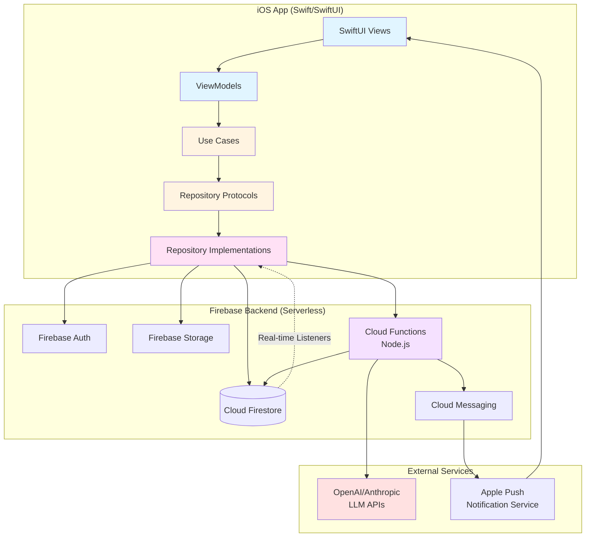

# High Level Architecture

## Technical Summary

MessageAI implements a **mobile-first Clean Architecture** with iOS native frontend and Firebase serverless backend. The iOS app uses SwiftUI with MVVM pattern, where ViewModels orchestrate use cases that interact with Firebase through repository protocol abstractions. Real-time messaging leverages Firestore snapshot listeners for < 2 second delivery, while offline-first persistence ensures zero message loss. AI features (summarization, action extraction, smart search, priority detection, decision tracking) execute server-side via Node.js Cloud Functions calling OpenAI/Anthropic APIs, protecting credentials and enabling aggressive result caching. The architecture achieves PRD goals through: (1) Clean Architecture enabling 70%+ test coverage for reliability, (2) Firebase eliminating backend infrastructure complexity, (3) MessageKit providing professional chat UI out-of-the-box, (4) Serverless AI integration optimizing costs through caching, and (5) offline-first data strategy guaranteeing message persistence across network conditions.

## Platform and Infrastructure Choice

**Platform:** Firebase (Google Cloud Platform)

**Key Services:**
- **Firebase Authentication**: Email/password authentication with automatic token refresh
- **Cloud Firestore**: Real-time NoSQL database with offline persistence for messages, conversations, users
- **Firebase Cloud Functions**: Node.js serverless functions for AI service calls and push notification generation
- **Firebase Cloud Messaging (FCM)**: Push notifications with APNs integration for iOS
- **Firebase Storage**: Image attachment hosting with security rules
- **Firebase Hosting**: (Future) Web admin dashboard if needed

**Deployment Host and Regions:**
- **Development Environment**: `us-central1` (Firebase default, lowest latency for development)
- **Production Environment**: `us-central1` (primary) with potential multi-region expansion post-MVP
- **iOS App Deployment**: TestFlight for beta testing, App Store for production

**Platform Rationale:**

Firebase was selected over alternatives (AWS Amplify, Supabase, custom backend) for three key reasons:

1. **Integrated Real-Time Infrastructure**: Firestore provides WebSocket-based real-time listeners out-of-the-box, essential for < 2 second message delivery without building custom WebSocket servers
2. **Offline-First by Design**: Firestore offline persistence automatically caches data and queues writes, solving the complex offline message queue requirement with minimal code
3. **Complete Backend-as-a-Service**: Authentication, file storage, push notifications, and serverless compute in one ecosystem eliminates integration complexity

**Alternative Considered:**
- **AWS Amplify**: More flexible but requires more manual configuration (Cognito + AppSync + Lambda + S3). Higher complexity for solo developer.
- **Supabase**: PostgreSQL-based with real-time subscriptions. Less mature iOS SDK, and relational schema adds complexity for flexible message data.
- **Custom Node.js Backend**: Maximum control but requires building auth, WebSocket infrastructure, push notification service, and deployment pipeline—unacceptable time investment for 7-day sprint.

## Repository Structure

**Structure:** Monorepo (Single Xcode Project)

**Monorepo Tool:** N/A (Standard Xcode project structure sufficient for iOS-only app)

**Package Organization:**

```
MessageAI/ (Git root)
├── MessageAI.xcodeproj          # Xcode project file
├── MessageAI/                    # iOS app source code
│   ├── App/                      # Application entry and DI
│   ├── Domain/                   # Business logic layer
│   │   ├── Entities/            # Pure Swift models
│   │   ├── UseCases/            # Business logic operations
│   │   └── Repositories/        # Repository protocols
│   ├── Data/                     # Data layer
│   │   ├── Repositories/        # Firebase implementations
│   │   ├── Network/             # Service wrappers
│   │   └── Models/              # Firebase DTOs
│   ├── Presentation/             # UI layer
│   │   ├── ViewModels/          # MVVM view models
│   │   ├── Views/               # SwiftUI views
│   │   └── Components/          # Reusable UI components
│   └── Resources/               # Assets, fonts, config files
├── MessageAITests/              # Unit and integration tests
├── MessageAIUITests/            # UI automation tests
├── CloudFunctions/              # Firebase Cloud Functions (Node.js)
│   ├── functions/
│   │   ├── src/
│   │   │   ├── ai/              # AI service integrations
│   │   │   ├── messaging/       # Message-related functions
│   │   │   └── notifications/   # Push notification logic
│   │   ├── package.json
│   │   └── index.js
│   └── .firebaserc              # Firebase project config
├── docs/                        # Project documentation
│   ├── prd.md
│   ├── architecture.md
│   └── stories/
└── .bmad-core/                  # BMAD workflow files
```

**Rationale:**
- iOS apps naturally fit monorepo structure—no need for polyrepo complexity
- Cloud Functions separated into `CloudFunctions/` directory but same Git repo for atomic versioning
- Clean Architecture folders enforce separation of concerns without complex tooling
- Tests colocated with source for easy discovery and maintenance

## High Level Architecture Diagram



## Architectural Patterns

**Overall Architecture:**

- **Clean Architecture (MVVM):** Separation of concerns with dependency inversion. Domain layer (entities, use cases) has zero external dependencies. Presentation and Data layers depend on Domain abstractions. Enables comprehensive unit testing with mocked repositories.  
  _Rationale:_ Achieves 70%+ code coverage requirement by making business logic testable without UI or Firebase dependencies. Critical for solo developer learning Swift—fast unit test feedback catches mistakes early.

- **Offline-First Architecture:** All data operations assume network unavailability. Firestore offline persistence automatically caches reads and queues writes. App remains fully functional offline with graceful degradation for AI features.  
  _Rationale:_ Satisfies PRD's zero message loss requirement and offline message queue functionality. Firestore handles complex synchronization logic automatically.

- **Serverless Backend:** No long-running servers. Cloud Functions execute on-demand for AI operations and push notifications. Firestore handles all data persistence and real-time sync.  
  _Rationale:_ Eliminates server management, auto-scales with usage, and optimizes costs (pay-per-execution). Perfect for MVP with unpredictable load patterns.

**Frontend Patterns (iOS):**

- **MVVM (Model-View-ViewModel):** SwiftUI Views bind to ViewModels via `@Published` properties. ViewModels coordinate use cases and expose UI state. Views are dumb presentation only.  
  _Rationale:_ Natural fit for SwiftUI's declarative paradigm. ViewModels are pure Swift classes easily tested without UI dependencies.

- **Repository Pattern:** Abstract data sources behind protocol interfaces. ViewModels depend on protocols, not concrete Firebase implementations. Enables swapping real repositories with mocks for testing.  
  _Rationale:_ Decouples business logic from Firebase specifics. Makes 70%+ test coverage achievable through fast unit tests with mocked data.

- **Use Case Pattern:** Single-responsibility classes encapsulating business operations (SendMessageUseCase, SummarizeThreadUseCase). Each use case has one public method and clear inputs/outputs.  
  _Rationale:_ Enforces separation of concerns and makes testing granular. Each use case tests independently without complex setup.

**Backend Patterns (Firebase Cloud Functions):**

- **Function-per-Feature:** Each AI capability is a separate Cloud Function (`summarizeThread`, `extractActionItems`, `detectPriorityMessages`). Functions are stateless and idempotent.  
  _Rationale:_ Enables independent deployment and scaling. Failures isolated to specific features without cascading.

- **Cache-Aside Pattern:** Cloud Functions check Firestore cache before calling expensive LLM APIs. Cache keys include message hashes for invalidation.  
  _Rationale:_ Reduces AI costs by 70%+ (estimated) through aggressive caching of summaries, action items, and search results.

**Integration Patterns:**

- **Backend-for-Frontend (BFF):** Cloud Functions act as iOS-specific API layer, formatting LLM responses into client-friendly JSON structures.  
  _Rationale:_ Protects API keys from client exposure and centralizes AI prompt engineering logic.

- **Real-Time Sync:** Firestore snapshot listeners provide push-based data updates. iOS app observes changes via AsyncStream or Combine publishers.  
  _Rationale:_ Achieves < 2 second message delivery requirement without polling overhead or WebSocket management.

- **Optimistic UI Updates:** Messages appear in UI immediately before server confirmation. Background sync updates status (sending → sent → delivered → read).  
  _Rationale:_ Provides instant user feedback while background reliability ensures delivery. Critical for responsive messaging UX.

---
